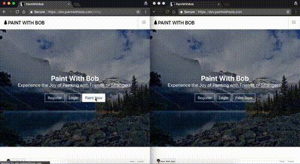

# Paint With Bob

🎨 Paint with Bob, Experience the Joy of Painting with Friends or Strangers! 🎨

## Usage

The application can either be accessed from the [live website](https://paintwithbob.com), the [developer webstie](https://dev.paintwithbob.com), or run locally by installing the project dependencies and running it.

## Install

The application is divided into three parts, the frontend 💻 ([Angular](https://angular.io/)), the backend 🖥️ ([Express](https://expressjs.com/)), the video service 📹 ([Node Media Server](https://www.npmjs.com/package/node-media-server), [FFMpeg](https://www.ffmpeg.org/), [Node Fluent FFMpeg](https://github.com/fluent-ffmpeg/node-fluent-ffmpeg))

1. Install [Nodejs](https://nodejs.org/en/download/package-manager/). I suggest using [nvm](https://github.com/creationix/nvm).

2. (Optional:) install [MongoDb](https://www.digitalocean.com/community/tutorials/how-to-install-mongodb-on-ubuntu-16-04) for database support on the backend.

3. Run `npm install` in the base directory of the application layer you are interested in running:

The frontend of the application is in: `frontend/`

The backend of the application is in: `backend/`

The video service of the application is in: `videoservice/lib`

4. Run `npm start`, and experience the joy of painting! 😊 NOTE: We use npm scripts for our projects, therefore all available scripts are in each layer's `package.json`.

## Contributing

🌟 Contributions are welcome! 🌟 We encourage the following process:

1. Fork the project 🍴
2. Create an [issue](https://github.com/PaintWithBob/paint-with-bob/issues) for discussion (or search to see if one already exists)
3. Create a branch
4. Make some changes
5. Commit your changes to a branch
6. Open a Pull Request!

This is currently a school project, and there are four of us maintaining this. However, once the semester ends, we will have to figure out how this runs on what server and things of that sort. 🎒

## License

LICENSE under [Apache 2.0](https://oss.ninja/apache-2.0) 🐦.
